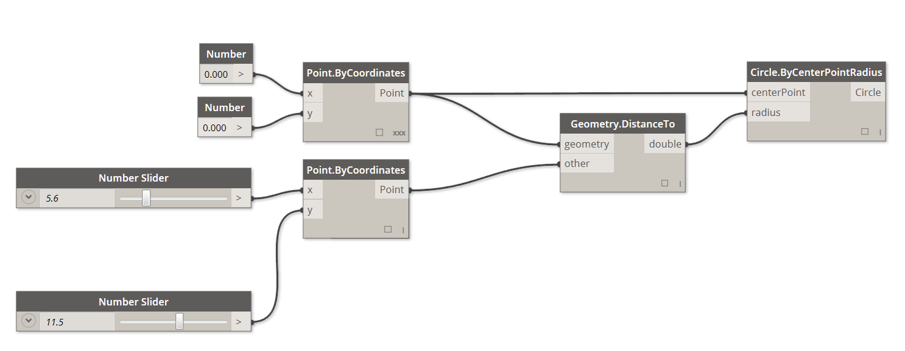

### 视觉编程概要

设计工作,在大部分的情况,设计要素之间的视觉关系,系统的关系、几何关系的决定发生的工作。通常,这种关系是根据规则概念,从创造具体成果根据流程被构建。我们意识到,算法,根据算法进行每天的业务。例如,输入、处理、输出的基本逻辑,按照阶段性业务。算法编程,捐给化,这种方法业务继续进行。

### 纸鹤,做客算法

**算法**非常方便的方法,但被错误理解的情况。预测算法,也不能创造美好的事物的可能性,但绝对不是魔法。实际上,算法本身是非常简单的东西。这一系列的顺序,根据折纸鹤做到。最初准备正方形的纸。这一系列的顺序,根据折纸鹤做到。在这种情况下,“输入”纸折叠顺序,“处理”,“输出”的纸鹤。


那么,纸鹤的哪里算法存在吧?算法是一系列的抽象顺序,文本和图形的表现都可以。

**文本解释的程序。:**

1. 正方形的纸,颜色的面表。以对角线从2折前回。其次,以对角线的另2折后回到前。。
2. 纸翻过来,白色面表。正方形的珀琉斯2折,折筋,回到开始。其次,不同的方向2折后回到前。
3. 到这里的折叠使用消息,纸的上方的3个角,角下的正方形耗折。
4. 前面的两个三角形的两边下辺为主线,配合前回折。
5. 上的角中央,折筋,回到开始。
6. 前面的部分打开袋子,一边举起两端中央走去,她折筋。
7. 纸翻过来,顺序4 ~ 6。
8. 上面的顶点配合中央前回折起。
9. 反对方面也同样的顺序反复。
10. 左右的“腿”,往下折,折筋,回到开始。
11. 上的顺序,沿着折左右的“腿”中折劈。
12. 另外中折劈了鹤的头,下调了羽毛的部分了。
13. 这是完成了纸鹤。

**图形的顺序的说明**


### 编程是

根据一方的顺序,折纸鹤也做到。实际上,折纸鹤算法制作的根据。唯一不同的是,被捐给一系列的顺序读方法。这是* * *,* *编程的原因。*计算机编程*(通常,省略了编程といいます),在一系列的处理,作为执行的程序的行为的捐给化。上述的鹤的折法,用计算机读取可以实行形式转换的情况下,进行编程。

编程中最先面临的重要课题,计算机和有效的沟通,为进行特定的抽象形式,应使用。其抽象化的形式,作为Python,C等,Javascript的编程语言被使用。刚才的鹤的折法一样制定可能的顺序反复的话,还有那只电脑翻译的。不久,用电脑制作纸鹤不仅各自不同,微妙的多数纸鹤也可以吧。这是编程的能力。什么样的任务分配给电脑,延迟和human错误发生不让任务可以反复执行。

#### 视觉与编程
> 此次练习中附属的样本文件 [Visual Programming - Circle Through Point.dyn](datasets/1-1/Visual Programming - Circle Through Point.dyn) 请下载(右单击[名字先保存链接]选择)。所有的样本文件的列表,请参照附录。

纸鹤的方法叙述的分配任务,那么如何执行这个任务吗?在这种情况下,图形中顺序叙述的方法,文本中顺序叙述的方法,结合图形和文本叙述的方法程序。

图形中叙述的顺序,或图形和文本组合顺序叙述的情况下,* * * *视觉编程最好的方法。通常的编程和视觉编程的两种情况,也基本过程是相同的。同样都捐给化的框架,使用视觉编程的情况是,视觉図形用戸使用用户界面,程序的指示和关系定义。在这种情况下,根据输入文本的句子,而是被事先包装化的节点相互连接起来。在这里,使用了同样的算法编程和文本,视觉的编程比较一下吧。“指定的分円弧,通过绘图”的命令,节点使用的例子和编程,代码编程时使用的例子。

**视觉编程:**



**文本的编程:**

```
myPoint = Point.ByCoordinates(0.0,0.0,0.0);
x = 5.6;
y = 11.5;
attractorPoint = Point.ByCoordinates(x,y,0.0);
dist = myPoint.DistanceTo(attractorPoint);
myCircle = Circle.ByCenterPointRadius(myPoint,dist);
```

这个算法的结果,下面是一样的。


这样,视觉编程,在视觉上容易理解的特点。因此,从最初简单的编程实践,可以设计人员来说也很方便的规格。Dynamo是视觉编程的范畴分类,应用内使用文本进行编程也可以。对此,最后说明。

